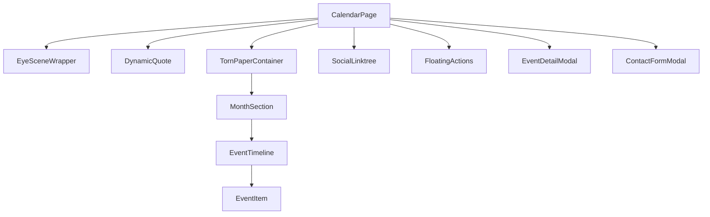

# Implementation Plan: Calendar & Linktree Page (P2)

This document outlines the strategy for transforming the current placeholder `/calendar` page into a dynamic, visually rich hub for events, releases, and social connections, following the "Neo-One" aesthetic.

## 1. Wireframe Analysis & Visual Language

### Main Page (/calendar)
*   **Background**: Dark, grimy texture (likely using `web-bg.webp` or similar).
*   **Header**: The `EyeScene` 3D component centered at the top, acting as the visual anchor.
*   **Quote**: Animated acid-green text ("Vieni a molestarmi...") using Framer Motion for a "glitch" or typewriter effect.
*   **Torn Paper Container**: The central UI element is a white "torn paper" block that holds the calendar data. This creates a high-contrast, analog-meets-digital vibe.
*   **Calendar Logic**: Organized by months (GENNAIO, FEBBRAIO). Each month contains a horizontal row of events.
*   **Event Items**: Minimalist thumbnails with dates hovering above. Some items have "PRE-ORDER" tags.
*   **Social Linktree**: A fixed bottom bar with stylized, vibrant social icons, draggable via framer-motion `drag="x"` for horizontal grab-to-scroll.
*   **Floating Actions**: Circular buttons on the right for "Share" and "Cart".

### Event Detail Overlay
*   **Aesthetic**: "Zine" style. Overlapping images, stickers (e.g., "Stupidi gadget in omaggio!"), and comic bubbles.
*   **Layout**: Asymmetric, utilizing the full screen but focused on a central content block.
*   **Interactions**: Close button (X with eye) at the bottom right.

### Contact Form Overlay
*   **Aesthetic**: Brutalist/Industrial. Clear borders, mono fonts, and high-contrast input fields.
*   **Fields**: Name, Email, Info (text area), Message (text area).
*   **Call to Action**: A "Send" button using a play or arrow icon.

---

## 2. Component Structure



### File Map
*   `src/app/(frontend)/calendar/page.tsx`: Main page component.
*   `src/components/calendar/TornPaper.tsx`: The stylized container with CSS masks or SVG edges.
*   `src/components/calendar/EventItem.tsx`: Individual event card with hover effects.
*   `src/components/calendar/EventDetail.tsx`: The modal content for event specifics.
*   `src/components/calendar/ContactForm.tsx`: The contact form modal content.
*   `src/components/calendar/SocialBar.tsx`: The linktree social bar with framer-motion `drag="x"` and `hasDragged` ref for click/drag disambiguation.
*   `src/app/api/contact/route.ts`: API handler for the form (Resend integration).

---

## 3. Data Schema (Mock)

```typescript
export interface NeoEvent {
  id: string;
  date: string; // e.g., "24"
  month: string; // e.g., "GENNAIO"
  thumbnail: string;
  isPreOrder?: boolean;
  details: {
    headline: string;
    subheadline?: string;
    description: string;
    images: string[];
    stickers: string[]; // paths to sticker assets
    comicBubble?: string; // Text for the comic bubble
  };
}

export interface SocialLink {
  id: string;
  name: string;
  url: string;
  icon: string;
}
```

---

## 4. Implementation Steps

### Phase 1: Foundation & Layout
1.  **Mock Data Setup**: Create `src/data/calendar-mock.ts` with events based on wireframes.
2.  **Base Page**: Update `src/app/(frontend)/calendar/page.tsx` to include `EyeScene` and the layout wrapper.
3.  **Torn Paper Utility**: Implement `TornPaper.tsx` using a custom CSS `clip-path` or SVG masks to replicate the wireframe edge.

### Phase 2: Calendar Timeline
1.  **Timeline Logic**: Map through the mock data to group events by month.
2.  **Event Component**: Build `EventItem.tsx` with Framer Motion hover states (glow, scale).
3.  **Responsive Adjustment**: Ensure the timeline wraps on mobile and stays horizontal on desktop.

### Phase 3: Interactive Overlays
1.  **State Management**: Use `useState` for `activeEventId` and `isContactOpen`.
2.  **Event Detail**: Build the "Zine" detail view. Use `AnimatePresence` for smooth entry/exit.
3.  **Contact Form**: Build the Brutalist form. Implement validation and the `Resend` route handler.

### Phase 4: Social Linktree & Polish
1.  **Social Bar**: Implement the fixed bottom bar with icons from `public/images/ui`.
2.  **Drag-to-Scroll**: Add framer-motion `drag="x"` on the social icons container with `dragConstraints` bounded to parent ref for horizontal grab-to-scroll.
3.  **Grab vs Click disambiguation**: Use a `hasDragged` ref � `onDragStart` sets it, the `<a>` `onClick` gate calls `preventDefault()` if a drag occurred, preventing accidental navigation after long-press grab.
4.  **Native drag suppression**: Suppress browser ghost-image drag on desktop via `draggable={false}`, `-webkit-user-drag: none`, and `onDragStart` `preventDefault()` on `<a>` and `<Image>` elements. `select-none` prevents text selection during drag.
5.  **Hover effects**: Moved from framer-motion&apos;s `whileHover` (which blocked parent drag gesture propagation) to pure CSS `group-hover:` utilities with spring-like cubic-bezier transitions.
6.  **Floating UI**: Add the Share and Cart buttons with &quot;Eye&quot; motifs.
7.  **Animations**: Apply global entrance animations (CRT flicker, typewriter for quotes).
8.  **MonthRow drag**: CalendarClient event rows also use `drag="x"` with `cursor-grab`/`active:cursor-grabbing` for horizontal event list scroll.

---

## 5. Animation Specs (Framer Motion)

*   **Quote**: `initial={{ opacity: 0, y: 10 }} animate={{ opacity: 1, y: 0 }} transition={{ duration: 0.8, delay: 0.5 }}`
*   **Torn Paper**: `initial={{ scaleX: 0 }} animate={{ scaleX: 1 }} transition={{ type: "spring", stiffness: 50 }}`
*   **Event Items**: `whileHover={{ y: -5, scale: 1.05 }} transition={{ type: "spring", stiffness: 300 }}`
*   **Modals**: `initial={{ opacity: 0, scale: 0.9 }} animate={{ opacity: 1, scale: 1 }} exit={{ opacity: 0, scale: 1.1 }}`
*   **SocialBar entrance**: `initial={{ opacity: 0, y: 20 }} animate={{ opacity: 1, y: 0 }} transition={{ duration: 0.6, ease: [0.32, 0.72, 0, 1], delay: 0.8 }}`
*   **SocialBar hover (icon lift)**: CSS `group-hover:-translate-y-2 group-hover:scale-110 group-hover:brightness-125` with `transition-all duration-300 ease-[cubic-bezier(0.34,1.56,0.64,1)]`
*   **SocialBar drag**: framer-motion `drag="x"` with `dragConstraints` bounded to parent ref. `cursor-grab` / `active:cursor-grabbing` for pointer feedback.
*   **MonthRow drag**: Same `drag="x"` + `cursor-grab` pattern applied to CalendarClient month event rows.

---

## 6. Constraints & Safety
*   **NO DB**: All data must reside in the mock file.
*   **NO Payload Config**: Use standard Next.js route handlers for the form.
*   **Design First**: Prioritize the high-fidelity aesthetic over perfect functionality for the P2 stage.


